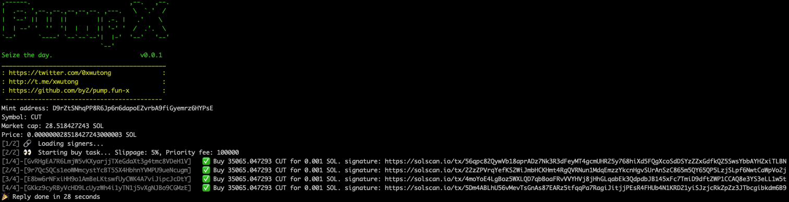
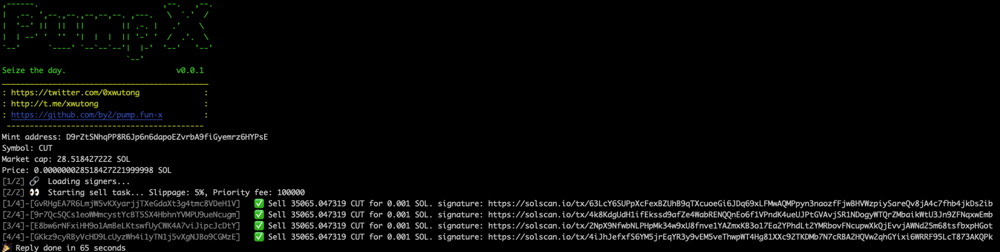
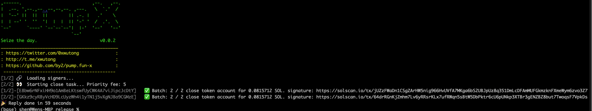
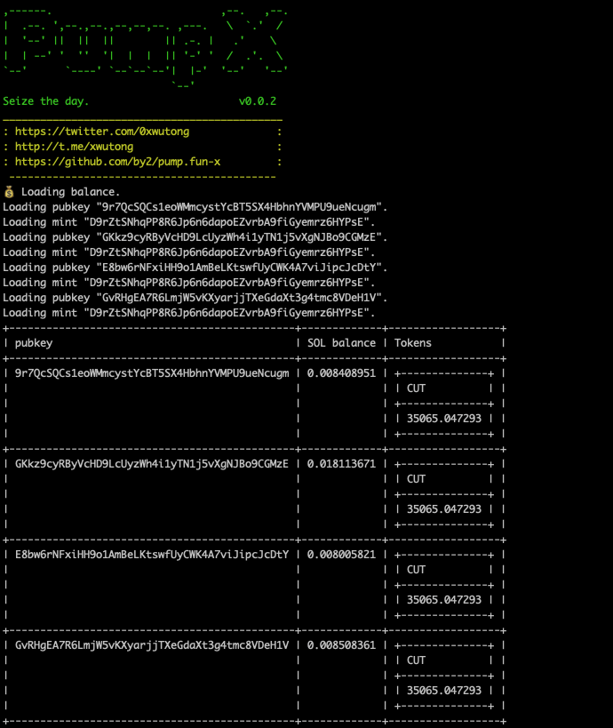

# pump.fun-x
Pump.fun-x is an automation tool for conducting buy and sell transactions on Solana. It supports multi-threaded operations, allowing for simultaneous transactions across multiple accounts to improve efficiency.

## Features
- **Buy**: Automate the purchase of specific Solana tokens.
- **Sell**: Automate the sale of specific Solana tokens.
- **Close**: Close token account and claim your SOL.
- **Balance**: Balance of Solana tokens.

## Screenshots

### Buy Operation



### Sell Operation



### Close Operation



### Balance Operation



## Usage

### Common Parameters
- --rpc: The RPC endpoint for the Solana network, defaults to https://api.mainnet-beta.solana.com.
- --jito-rpc: The Jito RPC endpoint, defaults to https://mainnet.block-engine.jito.wtf.
- --key-dir: The directory containing the keypair files for signing transactions.

### Buy Operation
```
pumpx --key-dir <KEY DIR> buy --mint-address <MINT_ADDRESS> --amount <SOL_AMOUNT> --percent <BUY_PERCENT> --slippage <SLIPPAGE> --priority-fee <PRIORITY_FEE> --jito-enable <BOOL> --jito-fee <JITO_FEE> --gateway-retries <RETRIES> --confirm-retries <RETRIES> --gateway-delay <MILLISECONDS> --confirm-delay <MILLISECONDS> --threads <THREADS>
```

- --mint-address: The mint address of the token to buy.
- --amount: The amount of SOL to use for buying, defaults to 0.0, indicating the use of the percent parameter for calculation.
- --percent: The percentage used to calculate the buy amount, defaults to 50.
- --slippage: Sets the maximum slippage, defaults to 5.
- --priority-fee: Sets the transaction's priority fee, defaults to 100000.
- --jito-enable: Whether to enable JitoTips, defaults to false.
- --jito-fee: The JitoTips fee, defaults to 0.0003 SOL.
- --gateway-retries: The number of gateway retries, defaults to 10.
- --confirm-retries: The number of confirmation retries, defaults to 1.
- --gateway-delay: The gateway delay in milliseconds, defaults to 500.
- --confirm-delay: The confirmation delay in milliseconds, defaults to 1000.
- --threads: Sets the number of threads, defaults to 4.

#### Example
```
./pump-x --key-dir ~/Desktop/keys buy --mint-address D9rZtSNhqPP8R6Jp6n6dapoEZvrbA9fiGyemrz6HYPsE --amount 0.001
```

### Sell Operation
```
pumpx --key-dir <KEY DIR>  sell --mint-address <MINT_ADDRESS> --percent <SELL_PERCENT> --slippage <SLIPPAGE> --priority-fee <PRIORITY_FEE> --jito-enable <BOOL> --jito-fee <JITO_FEE> --gateway-retries <RETRIES> --confirm-retries <RETRIES> --gateway-delay <MILLISECONDS> --confirm-delay <MILLISECONDS> --threads <THREADS>
```

- --mint-address: The mint address of the token to buy.
- --percent: The percentage used to calculate the buy amount, defaults to 100.
- --slippage: Sets the maximum slippage, defaults to 5.
- --priority-fee: Sets the transaction's priority fee, defaults to 100000.
- --jito-enable: Whether to enable JitoTips, defaults to false.
- --jito-fee: The JitoTips fee, defaults to 0.0003 SOL.
- --gateway-retries: The number of gateway retries, defaults to 10.
- --confirm-retries: The number of confirmation retries, defaults to 1.
- --gateway-delay: The gateway delay in milliseconds, defaults to 500.
- --confirm-delay: The confirmation delay in milliseconds, defaults to 1000.
- --threads: Sets the number of threads, defaults to 4.

#### Example
```
./pump-x --key-dir ~/Desktop/keys sell --mint-address D9rZtSNhqPP8R6Jp6n6dapoEZvrbA9fiGyemrz6HYPsE
```
### Close Operation
```
pumpx --key_dir <KEY DIR>  close --priority-fee <PRIORITY_FEE> --threads <THREADS>
```
- --priority-fee: Sets the transaction's priority fee, defaults to 10000.
- --threads: Sets the number of threads, defaults to 8.

#### Example
```
./pump-x --key-dir ~/Desktop/keys close
```

### Balance Operation
```
pumpx --key_dir <KEY DIR>  balance
```

#### Example
```
./pump-x --key-dir ~/Desktop/keys balance
```

## Notes
- Ensure you have sufficient SOL balance to cover transaction fees.
- Before engaging in transactions with substantial amounts, it is advisable to conduct tests with smaller amounts of capital
- Each purchase and sale transaction will earn me a tip of 0.0003 SOL. 
- Each close transaction will earn me 5% SOL.
- If you have a substantial volume of transactions, please contact me to purchase a license key.
- If you need the source code, you can contact for consultation on the price.

## Contact

- **Email**: [0xwutong@gmail.com](mailto:0xwutong@gmail.com)
- **Twitter**: [@0xwutong](https://twitter.com/0xwutong)
- **Telegram**: [xwutong](https://t.me/xwutong)
